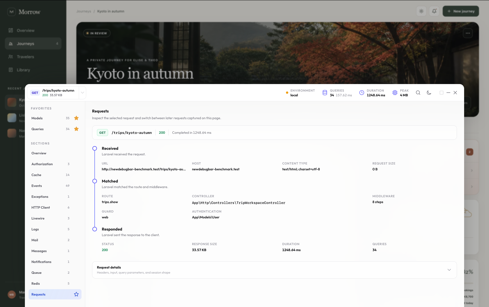

# New Debug Bar (for Laravel)



New Debug Bar is a modern debugging tool for Laravel, built for developers and coding agents. It helps you understand each request and find problems without cluttering your local app.

A compact bar at the bottom of the page gives you quick access to database queries, errors, logs, events, jobs, mail, cache use, and more.

It supports Inertia.

## Why I built New Debug Bar

I'm [Benjamin Crozat](https://x.com/benjamincrozat), and I built New Debug Bar because I wanted a debug bar that looks modern and is pleasant to use every day. Its clearer interface, favorite sections, and command palette make everyday debugging more convenient. Built-in MCP support gives coding agents direct access to focused debug data, making them faster and easier to work with.

If you find a bug or have an idea for a feature, please [open an issue](https://github.com/newdebugbar/newdebugbar/issues). I'd love to hear from you.

## Use with coding agents

New Debug Bar saves a clear profile for each request. A coding agent can use it to understand what happened, spot errors or slow work, explain the likely cause, and point you to what to inspect next. Common secrets are hidden, and the agent can only read the saved profiles.

Instead of giving the agent large logs, browser dumps, or a broad codebase and asking it to guess, it can request the small, relevant, structured summary or finding from a saved profile. In our nine-profile test, MCP used 68% fewer tokens than full profile dumps.

### Codex plugin

The optional Codex plugin is the simplest path for Codex users. It gives Codex a New Debug Bar skill and access to profiles from the Laravel app you have open, without manual MCP setup.

[Set up the Codex plugin](docs/mcp.md#codex-plugin).

### Others

Other compatible AI tools can use the same focused, read-only profile data through optional Model Context Protocol (MCP) support. Follow the [MCP setup guide](docs/mcp.md) for Claude Code, Cursor, VS Code, and other local MCP clients.

## Requirements

- PHP 8.1 or newer
- Laravel 10 or newer

## Install

Until v1 is tagged, install the current development version:

```bash
composer require --dev newdebugbar/newdebugbar:dev-main
```

Laravel loads it for you. Visit your app in the `local` environment. The bar will appear at the bottom of the page.

New Debug Bar uses Livewire 4 for its own interface. Your app does not need to use Livewire. Apps that already use Livewire 3 are not supported.

Keep the package in `require-dev` so it is not installed in production.

## Settings

The package works without any setup. To change its settings, publish the config file:

```bash
php artisan vendor:publish --tag=newdebugbar-config
```

To turn the bar off, add this to `.env`:

```dotenv
NEWDEBUGBAR_ENABLED=false
```

## License

New Debug Bar uses the Apache License 2.0.
